# Job Order Prioritization — Entity Relationship Diagram

Generated from [job_order_prioritization_schema.sql](job_order_prioritization_schema.sql).

Four logical layers, color-coded in the high-level view below:

1. **Reference / enum tables** — seeded by DDL, canonical values.
2. **Core entities** — `companies`, `jobs`, and the three transaction tabs (`client_submissions`, `placements`, `starts`).
3. **Feature lookups** — versioned aggregations recomputed quarterly, gated by an active `feature_lookup_version`.
4. **Scoring + routing** — `job_priority_scores` (append-only audit) and `job_routing` (current state).

## High-level dependency map

```mermaid
flowchart LR
    subgraph REF["1. Reference tables"]
        direction TB
        R1[job_status_ref]
        R2[job_type_ref]
        R3[category_ref]
        R4[client_type_ref]
        R5[placement_type_ref]
        R6[openings_bin_weights]
        R7[hour_bin_weights]
        R8[priority_tier_ref]
    end

    subgraph CORE["2. Core entities"]
        direction TB
        C1[companies]
        C2[jobs]
        C3[client_submissions]
        C4[placements]
        C5[starts]
    end

    subgraph FEAT["3. Feature lookups (versioned)"]
        direction TB
        F0[feature_lookup_version]
        F1[company_fill_rate_lookup]
        F2[company_category_fill_rate_lookup]
        F3[category_fill_rate_lookup]
        F4[skill_fill_rate_lookup]
        F5[client_type_fill_rate_lookup]
    end

    subgraph SCORE["4. Scoring + routing"]
        direction TB
        S1[job_priority_scores]
        S2[job_routing]
        S3[model_versions]
    end

    REF  --> CORE
    CORE --> FEAT
    REF  --> FEAT
    FEAT --> SCORE
    REF  --> SCORE
    CORE --> SCORE
```

## Full ERD

```mermaid
erDiagram

    %% ============================================================
    %% 1. REFERENCE / ENUM TABLES
    %% ============================================================

    job_status_ref {
        text status_code PK
        boolean is_placed_label
        boolean is_terminal
        text description
        smallint sort_order
    }

    job_type_ref {
        text job_type PK
        smallint encoded_value UK
        numeric fill_rate_weight
        text notes
    }

    job_type_alias {
        text raw_value PK
        text canonical_value FK
    }

    client_type_ref {
        text client_type PK
        numeric fill_rate_weight
        int sample_size
        boolean is_grouped_other
        text notes
    }

    category_ref {
        text category PK
        text parent_category
        numeric fill_rate
        int sample_size
        text notes
    }

    category_alias {
        text raw_value PK
        text canonical_value FK
    }

    openings_bin_weights {
        text openings_bin PK
        int min_openings
        int max_openings
        numeric fill_rate_weight
        smallint sort_order
    }

    hour_bin_weights {
        text hour_bin PK
        smallint min_hour
        smallint max_hour
        numeric fill_rate_weight
    }

    placement_type_ref {
        text placement_type PK
        text notes
    }

    priority_tier_ref {
        char tier PK
        numeric min_score
        numeric max_score
        int sla_minutes
        text action_description
    }

    %% ============================================================
    %% 2. CORE ENTITY TABLES
    %% ============================================================

    companies {
        bigint company_id PK
        text company_name
        boolean is_active
        timestamptz first_seen_at
        timestamptz last_seen_at
    }

    company_alias {
        bigint alias_company_id PK
        bigint canonical_company_id FK
        text source_tab
    }

    jobs {
        bigint job_id PK
        text vms_req_number
        boolean is_vms_order
        text status FK
        boolean is_placed
        int num_openings
        text job_title
        text category FK
        boolean category_imputed
        text required_skill
        text publishing_status
        boolean is_published
        text job_type FK
        timestamptz date_added
        text client_type FK
        text city
        text state_or_province
        text country_of_placement
        boolean is_us_placement
        bigint company_id FK
        timestamptz ingested_at
        text source_row_hash
    }

    client_submissions {
        bigint link_id PK
        bigint job_id FK
        bigint company_id "no FK; sub-entities resolved via company_alias"
        text submission_status
        timestamptz date_added
    }

    placements {
        bigint placement_id PK
        bigint job_id FK
        bigint company_id "no FK; sub-entities resolved via company_alias"
        text placement_type FK
        timestamptz date_added
    }

    starts {
        bigint placement_id PK
        bigint job_id FK
        bigint company_id "no FK; sub-entities resolved via company_alias"
        text placement_type FK
        timestamptz start_date
    }

    %% ============================================================
    %% 3. FEATURE LOOKUP TABLES (versioned)
    %% ============================================================

    feature_lookup_version {
        serial version_id PK
        timestamptz computed_at
        date training_period_start
        date training_period_end
        numeric global_base_fill_rate
        int smoothing_min_n
        boolean is_active
        text notes
    }

    company_fill_rate_lookup {
        int version_id PK
        bigint company_id PK
        int total_orders
        int placed_orders
        numeric fill_rate
        numeric smoothed_fill_rate
        char fill_rate_tier FK
    }

    company_category_fill_rate_lookup {
        int version_id PK
        bigint company_id PK
        text category PK
        int total_orders
        int placed_orders
        numeric fill_rate
    }

    category_fill_rate_lookup {
        int version_id PK
        text category PK
        int total_orders
        int placed_orders
        numeric fill_rate
    }

    skill_fill_rate_lookup {
        int version_id PK
        text required_skill PK
        int total_orders
        int placed_orders
        numeric fill_rate
    }

    client_type_fill_rate_lookup {
        int version_id PK
        text client_type PK
        int total_orders
        int placed_orders
        numeric fill_rate
    }

    %% ============================================================
    %% 4. SCORING + ROUTING
    %% ============================================================

    job_priority_scores {
        bigserial score_id PK
        bigint job_id FK
        numeric priority_score
        numeric predicted_fill_probability
        char tier FK
        numeric company_component
        numeric category_component
        numeric openings_component
        numeric job_type_component
        numeric client_type_component
        numeric hour_bin_component
        text scoring_method
        int feature_version_id FK
        text model_version
        timestamptz computed_at
    }

    job_routing {
        bigint job_id PK
        char current_tier FK
        timestamptz routed_at
        timestamptz sla_deadline
        text assigned_recruiter_queue
        boolean is_stalled
        timestamptz stalled_flagged_at
        timestamptz escalated_at
        bigint last_score_id FK
    }

    model_versions {
        text model_version PK
        timestamptz trained_at
        int feature_version_id FK
        int training_rows
        numeric auc
        numeric pr_auc
        text notes
        boolean is_active
    }

    %% ============================================================
    %% RELATIONSHIPS
    %% ============================================================

    %% --- Alias tables (raw value → canonical) ---
    job_type_ref      ||--o{ job_type_alias       : "canonicalized by"
    category_ref      ||--o{ category_alias       : "canonicalized by"
    companies         ||--o{ company_alias        : "canonicalized by"

    %% --- jobs ← reference tables ---
    job_status_ref    ||--o{ jobs                 : "classifies"
    job_type_ref      ||--o{ jobs                 : "classifies"
    category_ref      ||--o{ jobs                 : "classifies (nullable)"
    client_type_ref   ||--o{ jobs                 : "classifies (nullable)"
    companies         ||--o{ jobs                 : "owns"

    %% --- Transaction tabs ← jobs ---
    jobs              ||--o{ client_submissions   : "receives"
    jobs              ||--o{ placements           : "produces"
    jobs              ||--o{ starts               : "ultimately produces"

    %% --- Placements / starts ← reference ---
    placement_type_ref ||--o{ placements          : "typed by"
    placement_type_ref ||--o{ starts              : "typed by"
    placements         ||--o| starts              : "may start as"

    %% --- Feature lookups: version is the parent ---
    feature_lookup_version ||--o{ company_fill_rate_lookup          : "snapshot"
    feature_lookup_version ||--o{ company_category_fill_rate_lookup : "snapshot"
    feature_lookup_version ||--o{ category_fill_rate_lookup         : "snapshot"
    feature_lookup_version ||--o{ skill_fill_rate_lookup            : "snapshot"
    feature_lookup_version ||--o{ client_type_fill_rate_lookup      : "snapshot"

    %% --- Feature lookups ← dimension references ---
    companies          ||--o{ company_fill_rate_lookup           : "per company"
    companies          ||--o{ company_category_fill_rate_lookup  : "per company"
    category_ref       ||--o{ company_category_fill_rate_lookup  : "per category"
    category_ref       ||--o{ category_fill_rate_lookup          : "per category"
    client_type_ref    ||--o{ client_type_fill_rate_lookup       : "per client_type"
    priority_tier_ref  ||--o{ company_fill_rate_lookup           : "tiered as"

    %% --- Scoring + routing ---
    jobs                   ||--o{ job_priority_scores : "scored as (audit, append-only)"
    priority_tier_ref      ||--o{ job_priority_scores : "tier label"
    feature_lookup_version ||--o{ job_priority_scores : "computed under"

    jobs                   ||--|| job_routing        : "routed by (1:1, current state)"
    priority_tier_ref      ||--o{ job_routing        : "current tier"
    job_priority_scores    ||--o{ job_routing        : "last score"

    feature_lookup_version ||--o{ model_versions     : "feature snapshot used"
```

## Cardinality cheat-sheet

| Relationship | Cardinality | Notes |
|---|---|---|
| `companies → jobs` | 1 → many | All jobs have a canonical company. |
| `jobs → client_submissions` | 1 → many | ~1.85 subs per job on average. |
| `jobs → placements` | 1 → 0..many | Only ~53% of jobs result in a placement (any source). |
| `placements → starts` | 1 → 0..1 | Not every placement results in a start. |
| `companies → company_alias` | 1 → 0..many | 122 canonical companies, ~1,514 distinct sub-entity IDs in placements. |
| `feature_lookup_version → *_fill_rate_lookup` | 1 → many | Each lookup snapshot is pinned to one version. |
| `jobs → job_priority_scores` | 1 → 0..many | Append-only audit; one row per scoring event. |
| `jobs → job_routing` | 1 → 0..1 | Current routing state, PK = `job_id`. |
| `priority_tier_ref → job_routing` | 1 → many | Tier currently assigned. |
| `job_priority_scores → job_routing.last_score_id` | 1 → 0..many | Round-trip from current routing back to the score that produced it. |

## Things worth knowing that the ERD can't show

- **No FK on `company_id` in `client_submissions`, `placements`, or `starts`.** This is deliberate — those CSVs carry sub-entity IDs (~1,514 unique in placements vs 122 canonical in `companies`). The mapping is in `company_alias`, populated post-load by `populate_company_aliases()`.
- **`jobs.is_placed`, `is_vms_order`, `is_published`, `is_us_placement`** are STORED generated columns — derived from other columns at write time, not foreign keys.
- **`feature_lookup_version.is_active` has a partial unique index** (`WHERE is_active`) — at most one row can be `is_active = TRUE` at any time. Same applies to `model_versions.is_active`.
- **`v_priority_score_calc`** is the view that joins jobs to the *active* feature lookup version's rows and computes the weighted score on the fly. Not shown on the ERD because it's a view, not a table.

## Rendering options

- **GitHub** — renders inline if you paste this file into a `.md` in a repo.
- **VS Code** — install "Markdown Preview Mermaid Support" (`bierner.markdown-mermaid`) and preview this file.
- **Mermaid Live** — paste either fenced block into <https://mermaid.live> to get a PNG/SVG export.
- **CLI** — `npm i -g @mermaid-js/mermaid-cli` then `mmdc -i job_order_prioritization_erd.md -o erd.png`.
